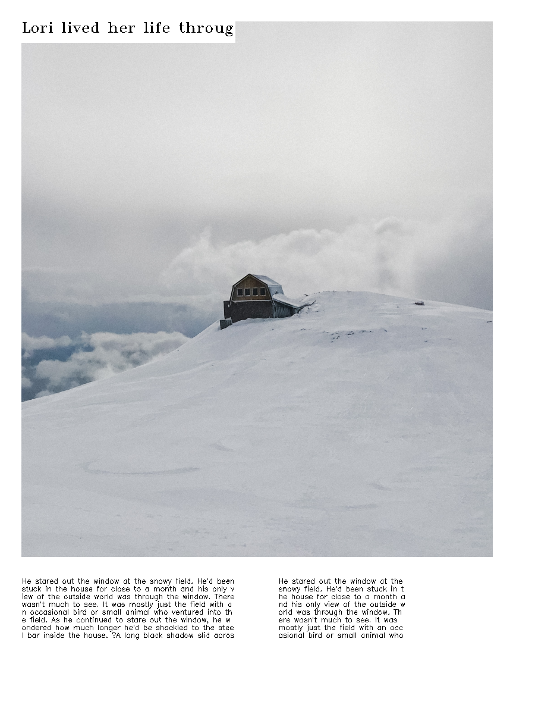
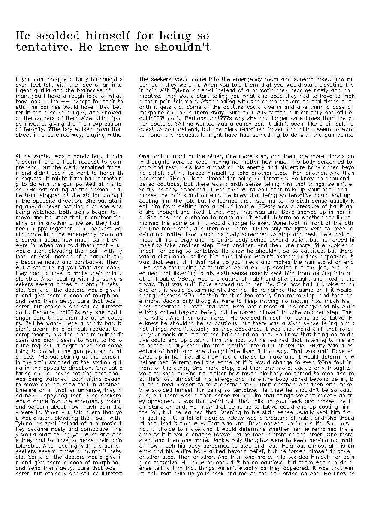
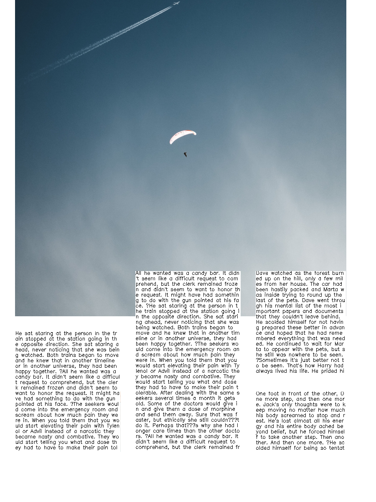
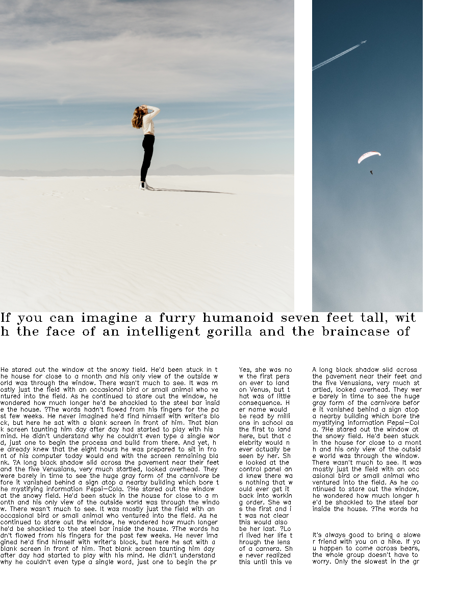
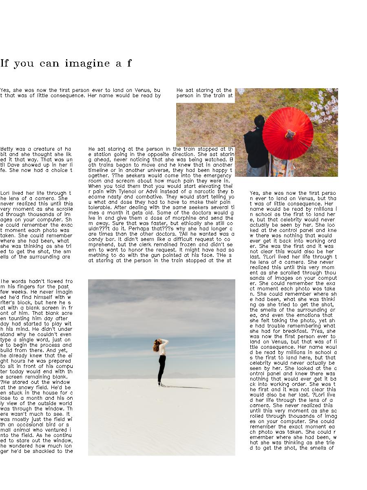
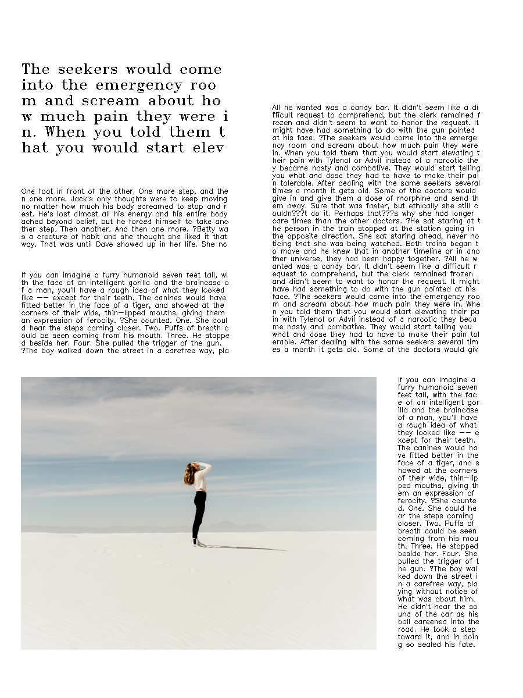
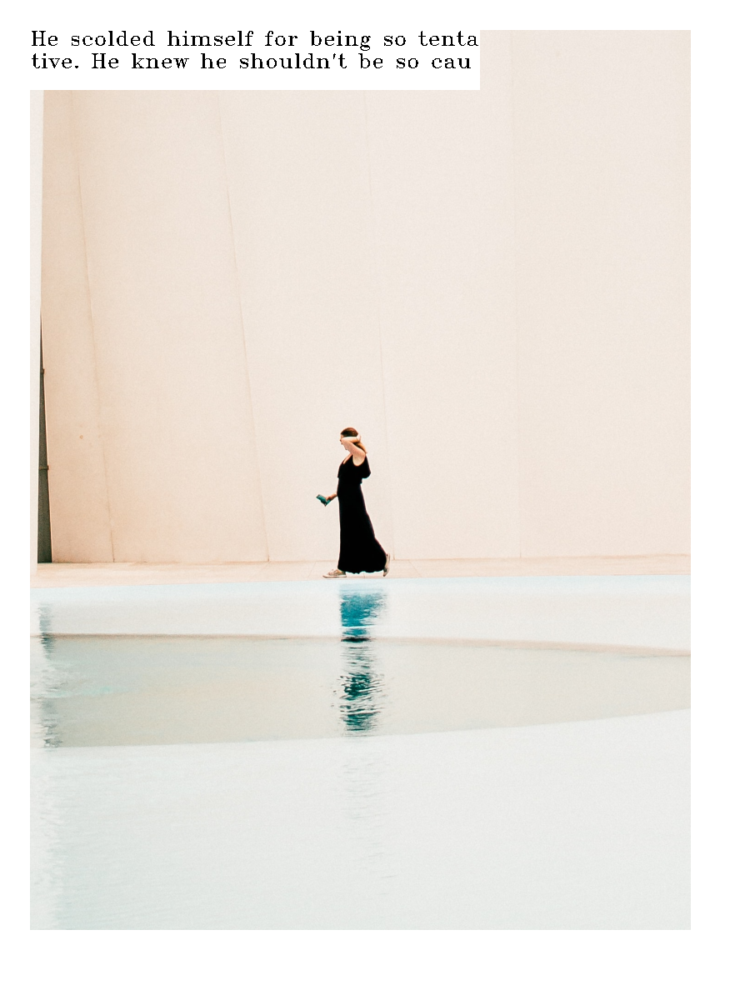
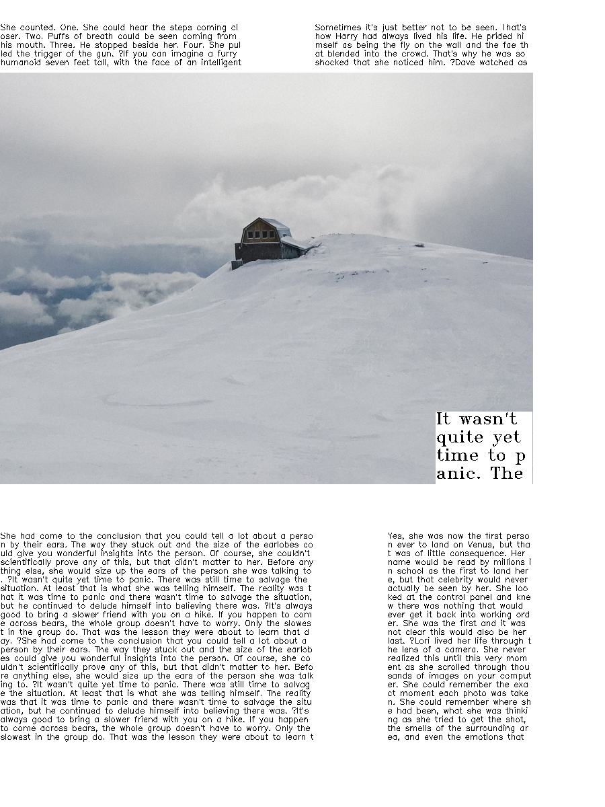

# Conditional Generative Modelling of Graphic Design Layouts

## Abstract

_Background._ Layout, the set of positions and sizes of design elements, is fundamental in creating graphic designs which achieve effective visual communication. Generating effective layouts manually is non-trivial, time consuming and requires extensive knowledge.

_Methods._ We propose a solution to automate the generation of single-page magazine layouts. Our solution is comprised of three modules. A conditional wasserstein deep convolutional generative adversarial network (cWDCGAN) which learns the latent distribution of layout design elements to generate new samples conditioned on a text proportion label. A refinement algorithm which refines the model’s output and enforces the graphic design principle of alignment. Third, a novel layout image cropping algorithm which extends our solution to be content-aware by addressing the layout of image sources within image elements to avoid the occlusion of salient image source areas.

_Results._ We implemented an algorithm to generate layouts. A user study comprised of 44 participants was then conducted to evaluate the efficacy of our generated layouts relative to professionally designed human-made layouts. When compared with human-designed layouts, participants selected our layouts as more effective 34.8% of the time.

_Conclusion._ Our solution is able to conditionally generate novel layouts comparable to state of the art techniques and professional human designers. We propose further applications of our algorithm to augment the traditional design process and improve existing commercial solutions.

## Example Images

8 cherrypicked layouts.

  
  
  
  

  
  
  
  

## Usage

### Graphical user interface (GUI)

We have developed an intuitive GUI which aids the user in creating graphic design layouts using our implementation. To start the GUI, simply run the following command:
`python gui.py`

### Generate static renders

It is also possible to render static mockup renders using our algorithm. To do so, execute the "ours" function defined in `model.py` with a text proportion label in [0,3] as the parameter.

For example, to generate a layout with a very small amount of text, we can execute `cv.imwrite("render.png", ours(0))`,
which will use OpenCV to save the mockup layout image to a file in the root directory named "render.png". Similarly, to generate a layout with a large amount of text, we can execute `cv.imwrite("render.png", ours(3))`.

For convenience, simply running `python model.py` will generate 4 such sample renders.

## Files

**`images`**
Contains some example images for usage as image sources when generating layouts. These images are chosen specifically as they work well with the image saliency estimation algorithm RBD.

**`training_data/gen_training_images.py`**
Convert the annotations of `training_data/annotations` into images for each layout. These images are stored in `training_data/layout_images`.

**`training_data/gen_training_labels.py`**
Convert the annotations of `training_data/annotations` into labels for each layout. These labels are stored in `training_data/layout_labels`.

**`cWDCGAN.ipynb`**
Used to train our generative model.

**`generator.pth`**
A pre-trained checkpoint for the generator.

**`generator.py`**
Used to generate layout images.

**`gui.py`**
The graphical user interface for our algorithm.

**`model.py`**
This contains 3 different algorithms. Our best algorithm (ours), our best algorithm without our refinement step (b1), and our best algorithm without our image cropping algorithm (b2).

**`refinement.py`**
The implementation of our refinement step.

**`render.py`**
The implementation of our static layout image rendering engine.

**`salience.py`**
Our image cropping algorithm implementation.

## Sources

**Overall Project** - Based on [Zheng, X. Qiao, Y. Cao, and R. W. Lau, “Content-aware generative modeling of graphic design layouts,” ACM Transactions on Graphics (TOG), vol. 38, no. 4, pp. 1–15, 2019](https://xtqiao.com/projects/content_aware_layout/paper.pdf)

`images` - The images in this dataset were sourced from [Unsplash](unsplash.com).

`training_data/annotations` - [Zheng, X. Qiao, Y. Cao, and R. W. Lau, “Content-aware generative modeling of graphic design layouts,” ACM Transactions on Graphics (TOG), vol. 38, no. 4, pp. 1–15, 2019](https://xtqiao.com/projects/content_aware_layout/)

`training_data/gen_training_labels.py/polyArea` - https://stackoverflow.com/a/30408825 accessed on 24/03/2022

`cWDCGAN.ipynb` - https://pytorch.org/tutorials/beginner/dcgan_faces_tutorial.html, https://pytorch.org/tutorials/beginner/basics/data_tutorial.html, https://github.com/znxlwm/pytorch-MNIST-CelebA-cGAN-cDCGAN, https://github.com/eriklindernoren/PyTorch-GAN/blob/master/implementations/wgan/wgan.py, https://machinelearningmastery.com/how-to-train-stable-generative-adversarial-networks/

`refinement.py/overlapping_area` - https://stackoverflow.com/a/27162334 accessed on 27/03/2022

`salience.py/scale_image` - https://www.tutorialkart.com/opencv/python/opencv-python-resize-image/ accessed on 27/03/2022

`salience.py/get_saliency_rbd` - https://github.com/yhenon/pyimgsaliency accessed on 27/03/2022

`salience.py/find_aalir` - Based on https://github.com/lukasalexanderweber/lir accessed on 27/03/2022
